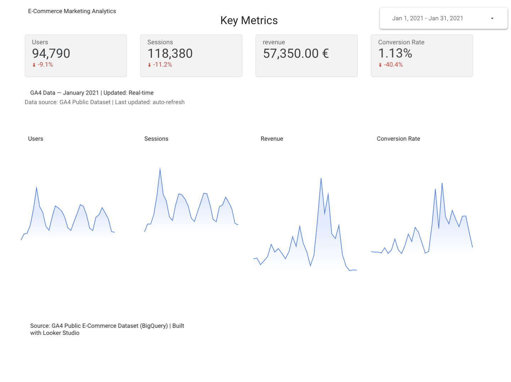
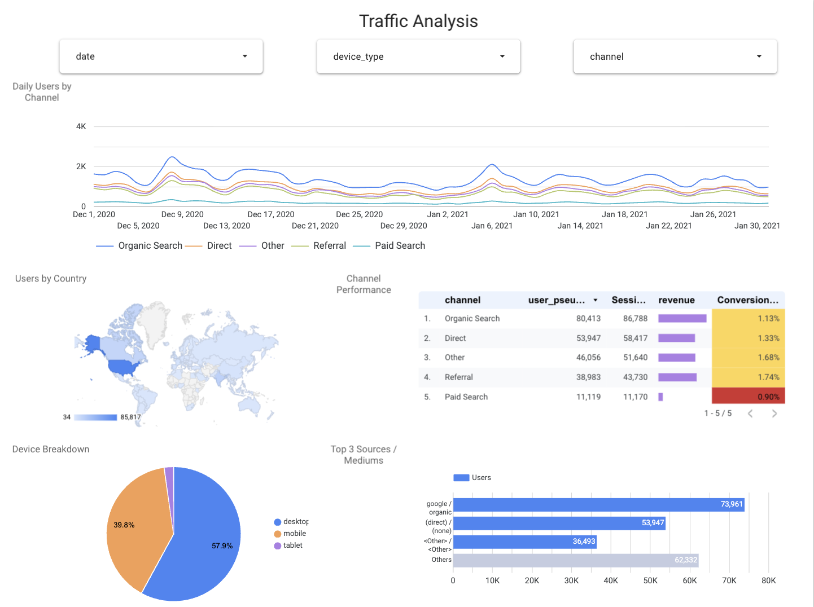
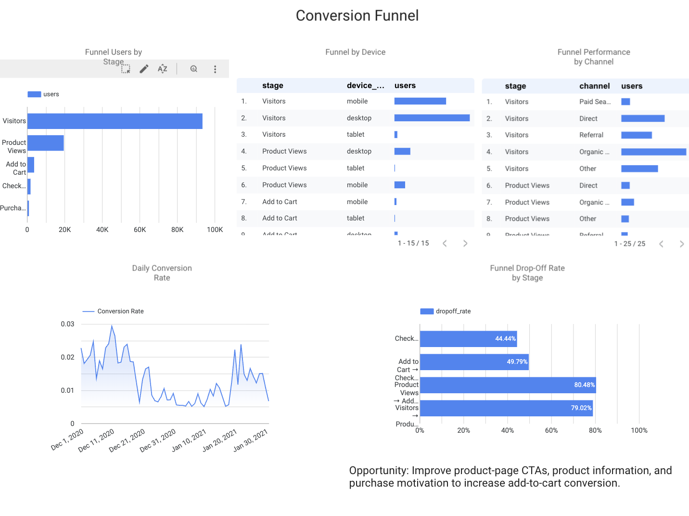

# E-Commerce Marketing Analytics Dashboard

An interactive Looker Studio report analyzing GA4 public e-commerce data for January 2021. The dashboard brings acquisition, audience, revenue, and conversion-funnel metrics together for a quick performance review.

## Dashboard

🔗 [Live Dashboard](https://lookerstudio.google.com/reporting/cda2fd1d-e8a7-45d7-a32c-c80461883b32)

### Preview

Click any image to open the interactive dashboard.

#### Key Metrics

#### Traffic Analysis

#### Conversion Funnel

### Features

- KPI scorecards for users, sessions, revenue, and conversion rate, with period comparison
- Traffic trends by channel, with a geographic breakdown by country
- Channel performance table, device breakdown, and top source/mediums
- Conversion funnel with step-by-step drop-off rates, including device and channel breakdowns
- Interactive date-range, channel, and device-type filters

**Data source:** GA4 Public E-Commerce Dataset (BigQuery)  
**Built with:** Looker Studio
